# 矿山安全监测系统——离线语音识别与 LoRa 通信实验方案

> 适用赛事：2026 年华北五省（市、自治区）及港澳台大学生计算机应用大赛
> 文档版本：v1.0　　日期：2026-09-21
> 配套代码：`esp32s3-kws/`（井下节点1）、`mine-safety-system/firmware/`（地面网关）

**文档结构**：一、背景与应用场景（政策背书）→ 二、系统总体方案（方框图）→ 三、分节点设计（含接线与流程图）→ 四、通信协议（含时序图）→ 五、实验方案（指标与记录表）→ 六、创新点 → 七、开源与许可声明 → 八、风险与应对 → 九、进度 → 附录（纯文本方框图、参考来源）

**图表索引**（共 12 张，均为 Mermaid 图，可在 VS Code / Typora 中右键导出 PNG 插入 Word）

| 编号 | 图名 | 位置 |
|---|---|---|
| 图 1 | 系统总体方框图 | 2.2 |
| 图 2 | 部署拓扑图（井下—井上） | 2.4 |
| 图 3 | 节点1 运行状态机 | 2.5 |
| 图 4 | 节点1 结构方框图 | 3.1 |
| 图 5 | 节点1 固件主流程 | 3.1 |
| 图 6 | 节点2 结构方框图 | 3.2 |
| 图 7 | 节点2 软件流程 | 3.2 |
| 图 8 | 地面网关结构方框图 | 3.3 |
| 图 9 | 网关报文处理与分级报警流程 | 3.3 |
| 图 10 | 应急通道时序图 | 4.3 |
| 图 11 | 日常转写通道时序图 / 分片重传时序图 | 4.4 / 4.5 |
| 图 12 | 总体方框图（纯文本版，便于直接粘入 Word） | 附录 A |

---

## 一、项目背景与应用场景（含政策与数据背书）

### 1.1 行业背景

- 煤炭仍是我国能源安全的"压舱石"：2023 年原煤产量 47.1 亿吨，占能源消费比重 55.3%。<sup>[1]</sup>
- 矿山智能化已进入规模化建设阶段：截至 2024 年 6 月底，国家首批智能化示范煤矿通过现场验收 60 余座（验收完成率 87%），累计建成智能化采煤工作面 1900 余个、掘进工作面 2100 余个，智能化建设总投资规模超 2000 亿元。<sup>[1]</sup>
- 现有智能化矿山通信以 5G、Wi-Fi 6 与工业以太网为主，标准评价项要求"井下具备条件的位置实现无线覆盖、具备断链保护功能"。<sup>[1]</sup> 但在**断电、断网、无覆盖区域**（深部巷道、盲巷、灾变后区域），仍缺少可靠的容灾通信手段。

### 1.2 政策依据（背书）

| 文件 | 关键要求（与本案相关） |
|---|---|
| 《关于深入推进矿山智能化建设促进矿山安全发展的指导意见》（国家矿山安监局等七部门，2024 年 4 月） | 到 2026 年：全国煤矿智能化产能占比不低于 60%，**全国矿山井下人员减少 10% 以上**，打造一批单班作业人员不超 50 人的智能化矿山；实现"环境智能感知、系统智能联动、重大灾害风险智能预警"。<sup>[2]</sup> |
| 新版《煤矿安全规程》（应急管理部令第 17 号，2025-07-24 公布，**2026-02-01 施行**） | 第 543–545 条：下井人员必须携带标识卡，出入井口与重点区域应设读卡分站；**人员位置监测系统应具备标识卡正常性与唯一性检测功能，异常时报警**；矿调度室值班员应监视人员位置信息。<sup>[3]</sup> |
| 新版《煤矿安全规程》专题新闻发布会（国家矿山安监局，2025-08-13） | 新规程全稿提及"智能"3 次、"无人/不设专人"23 次、"远程"11 次、"视频监视"23 次，明确智能化技术应用方向，服务"**无人则安、少人则安**"。<sup>[4]</sup> |
| 《关于加快煤矿智能化发展的指导意见》（发改能源〔2020〕283 号）、《煤矿智能化建设指南（2021 年版）》（国能发煤炭规〔2021〕29 号） | 煤矿智能化建设与验收的纲领性文件。<sup>[1]</sup> |
| 国家标准计划《煤矿井下人员位置监测系统通用技术要求》（计划号 20251546-Q-627，国家矿山安监局归口） | 同类井下无线系统的指标参照：漏/误读率 ≤ 10⁻⁴、定位卡与分站无遮挡无线传输距离 ≥ 400 m、系统最大巡检周期 ≤ 5 s、电网停电后备用电源连续监控 ≥ 4 h。<sup>[5]</sup> |
| 《煤矿安全生产条例》（国务院令第 774 号，2024-01-24 公布，**2024-05-01 施行**） | 第二十七条：井工煤矿应当有符合煤矿安全规程和国家标准或行业标准规定的安全出口、独立通风系统、**安全监控系统**、防尘供水系统等；并将"**未按照规定建立监控与通讯系统，或者系统不能正常运行的**"列为违法情形；同时要求煤矿按安全生产电子数据规范**联网并实时上传电子数据**，对数据真实性、准确性、完整性负责。<sup>[6]</sup> |
| 《煤矿井下安全避险"六大系统"建设完善基本规范（试行）》（安监总煤装〔2011〕33 号）及配套通知（安监总煤装〔2010〕146 号） | "六大系统" = 监测监控、人员定位、紧急避险、压风自救、供水施救、**通信联络**；**所有井工煤矿必须按规定建设完善**，达到"系统可靠、设施完善、管理到位、运转有效"；通信联络系统须按"**灾变期间能够及时通知人员撤离和实现与避险人员通话**"的要求建设完善，并要求积极推广井下无线通讯与广播系统。**（属政策沿革文件，现行有效要求见 [3][6][9]）**<sup>[7][8]</sup> |
| 国家矿山安全监察局贵州局、贵州省能源局《关于进一步加强煤矿"三大系统"安全管理的通知》（2026-08-04） | 人员位置监测分站应覆盖井下所有区域；标识卡应具有"**向定位分站发出事故报警信息、接收紧急撤人命令**、声光和振动报警、低电量指示报警"等功能，且**该功能不能为选用项**。<sup>[9]</sup> |

> **背书要点归纳**：上述文件共同指向两条刚性要求——① **通信联络在灾变期间必须可用**（不能只依赖易损的电缆与基站）；② **人员必须能主动发出报警**（且不得作为选用项）。本方案正是针对这两条的补充实现：不依赖井下网络与市电的语音报警通道，以及日常语音文本回传。

### 1.3 痛点（本方案切入点）

1. **应急通信缺口**：事故常伴随断电、断网、线缆中断。"六大系统"规范虽明确要求通信联络系统做到"灾变期间能够及时通知人员撤离和实现与避险人员通话"<sup>[7]</sup>，但既有实现（有线电话、井下广播、基站式无线）在电缆与基站受损后往往同时失效，"最后一公里"的信息发不出去。
2. **汇报手段原始**：井下日常沟通多靠喊话、对讲机或升井后补记录，缺少"就地转文字、自动上报"的手段。
3. **改造成本高**：为全覆盖部署 5G/Wi-Fi 6 成本高，盲巷与临时作业面难以短期覆盖。

### 1.4 应用场景

| 场景 | 描述 | 依托能力 | 政策/标准依据（背书） |
|---|---|---|---|
| **S1 应急呼救（核心）** | 瓦斯超限、透水、塌方、人员被困等，人员直接喊出"救命 / 撤离 / 瓦斯 / 透水"，节点本地离线识别，经 LoRa 直发地面报警 | 离线命令词识别 + 低功耗 MCU + 独立 LoRa 链路，不依赖井下网络与市电 | "六大系统"要求通信联络系统做到"**灾变期间能够及时通知人员撤离和实现与避险人员通话**"<sup>[7]</sup>；要求标识卡"**向定位分站发出事故报警信息、接收紧急撤人命令**"<sup>[9]</sup>；《煤矿安全生产条例》将"监控与通讯系统不能正常运行"列为违法情形<sup>[6]</sup> |
| **S2 日常语音汇报（核心）** | 巡检时口述"三号巷道风机有异响，请求派人检查"，节点本地转写成文字上报，免人工记录 | 离线 ASR（Linux 级算力）+ LoRa 文本传输 | 要求实现"环境智能感知、系统智能联动"<sup>[2]</sup>；国家鼓励提升煤矿智能化开采水平<sup>[6]</sup> |
| **S3 地面汇聚与预警分析** | 网关接收任一节点数据，声光报警、短信通知，并上传云端留存与分析 | LoRa 汇聚 + 上云 | 要求按安全生产电子数据规范"**联网并实时上传电子数据**"，对真实性、准确性、完整性负责<sup>[6]</sup>；"重大灾害风险智能预警"<sup>[2]</sup> |
| **S4 无覆盖区补盲（盲巷、掘进头、临时作业面）** | 无需布设 5G/Wi-Fi，单点部署即可回传数据；灾变后原有系统损毁时可作为过渡通道 | LoRa 点对多点、可电池供电、部署快 | 《煤矿安全规程》要求井筒落底进入巷道施工前"**必须形成安全监控、通信联络等系统**"<sup>[3]</sup>；"六大系统"须"系统可靠、设施完善、管理到位、运转有效"<sup>[7]</sup> |
| **S5 减人增效与合规留痕** | 汇报与巡检记录自动化，减少井下人员数量与暴露时间；事件数据可追溯 | 语音转写 + 自动上报与留痕 | "全国矿山井下人员减少 10% 以上"、打造单班不超 50 人的智能化矿山<sup>[2]</sup>；电子数据须真实、准确、完整<sup>[6]</sup> |

**场景落地优先级**：演示与答辩建议按 **S1（应急呼救）→ S3（地面汇聚上云）→ S2（日常汇报）** 的顺序呈现——先证明"灾变可用"，再证明"数据闭环"，最后证明"日常好用"。

---

## 二、系统总体方案

### 2.1 设计原则

1. **双通道分级**：应急通道（MCU + 离线命令词，秒级、断网可用）与日常通道（Linux + 离线转写，信息量大）并存，互不依赖。
2. **离线优先**：识别与传输均不依赖公网，符合井下无网/断网场景。
3. **低带宽适配**：只传文本与事件码，不传原始音频（LoRa 空口 ≈ 5.5 kbps）。
4. **保底可用**：任一节点故障不影响另一节点；地面网关报警逻辑不依赖 Linux。

### 2.2 系统方框图（总体）

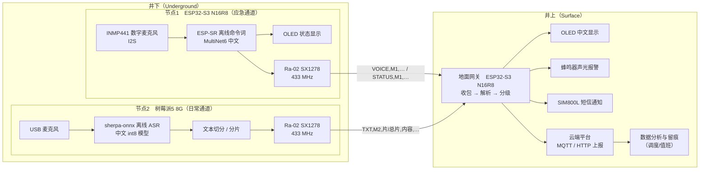

> 说明：上图为 Mermaid 图，可在 Typora / VS Code / Markdown 预览中直接渲染并导出 PNG 用于 Word 方案书；若需纯文本版见附录 A。

### 2.3 功能分配

| 节点 | 主控 | 语音能力 | 通信 | 定位（本方案） |
|---|---|---|---|---|
| 节点1 | ESP32-S3 N16R8 | 离线命令词（紧急/常用命令） | LoRa 433 MHz | 应急报警、心跳在线 |
| 节点2 | 树莓派 5（8 GB） | 离线连续语音识别（任意句子 → 文本） | LoRa 433 MHz | 日常语音汇报 |
| 地面网关 | ESP32-S3 N16R8 | 无 | LoRa 433 MHz + 短信/上云 | 汇聚、报警、上传 |

---

### 2.4 部署拓扑图

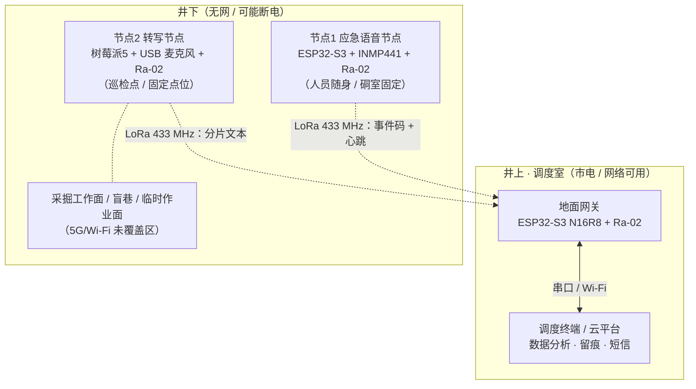

### 2.5 系统运行状态机（节点1）

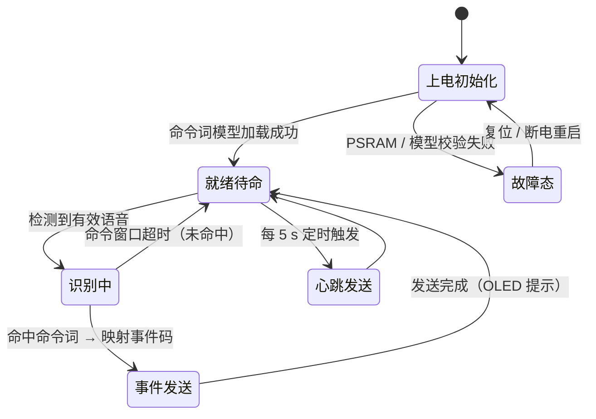

---

## 三、分节点设计

### 3.1 节点1：ESP32-S3 应急语音节点

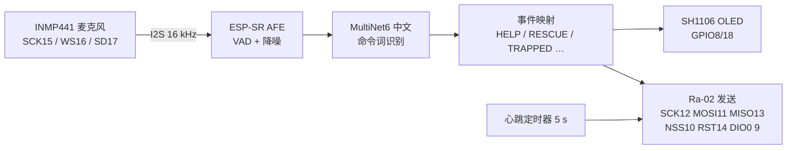

**关键指标（实测）**

| 项 | 结果 |
|---|---|
| 启动到就绪 | ≈ 1.5 s |
| 中文模型加载 | 中文命令词注册成功（示例：`jin ji jiu ming` / `qing qiu jiu yuan` / `you ren bei kun`） |
| LoRa 识别 | `SX1278 就绪: 433 MHz, sync=0xA3` |
| 心跳 | 每 5 s 发送 `STATUS,M1,KWS_READY,n` |

**技术要点（可写入创新点）**

1. 补齐了 Arduino-ESP32 生态中**中文命令词无法离线注册**的问题：该内核自带 esp-sr 以英文 MultiNet7 配置编译（`CONFIG_SR_MN_EN_MULTINET7_QUANT`），`esp_mn_commands_*` 会走英文音素转换导致中文命令全部非法；本方案直接组命令链表调用模型自身的 `set_speech_commands()`，使中文（拼音）命令词可离线注册。
2. 修正内核在"模型包缺少对应网络"时把空指针当字符串格式化导致的**启动崩溃**（LoadProhibited → 无限重启），保证在当前模型包配置下可稳定运行。

**硬件接线（节点1）**

| 模块 | 模块引脚 | ESP32-S3 | 说明 |
|---|---|---|---|
| INMP441 麦克风 | SCK / WS / SD | GPIO15 / GPIO16 / GPIO17 | I²S 输入；L/R 接 GND，VDD 接 3.3 V |
| Ra-02（SX1278） | SCK / MOSI / MISO / NSS / RST / DIO0 | GPIO12 / GPIO11 / GPIO13 / GPIO10 / GPIO14 / GPIO9 | SPI 接口；433 MHz，同步字 0xA3 |
| OLED SH1106 | SCL / SDA | GPIO18 / GPIO8 | I²C，100 kHz |
| 供电 | 3.3 V / GND | — | Ra-02 的 VDD–GND 就近并 100 µF + 0.1 µF |

**固件主流程**

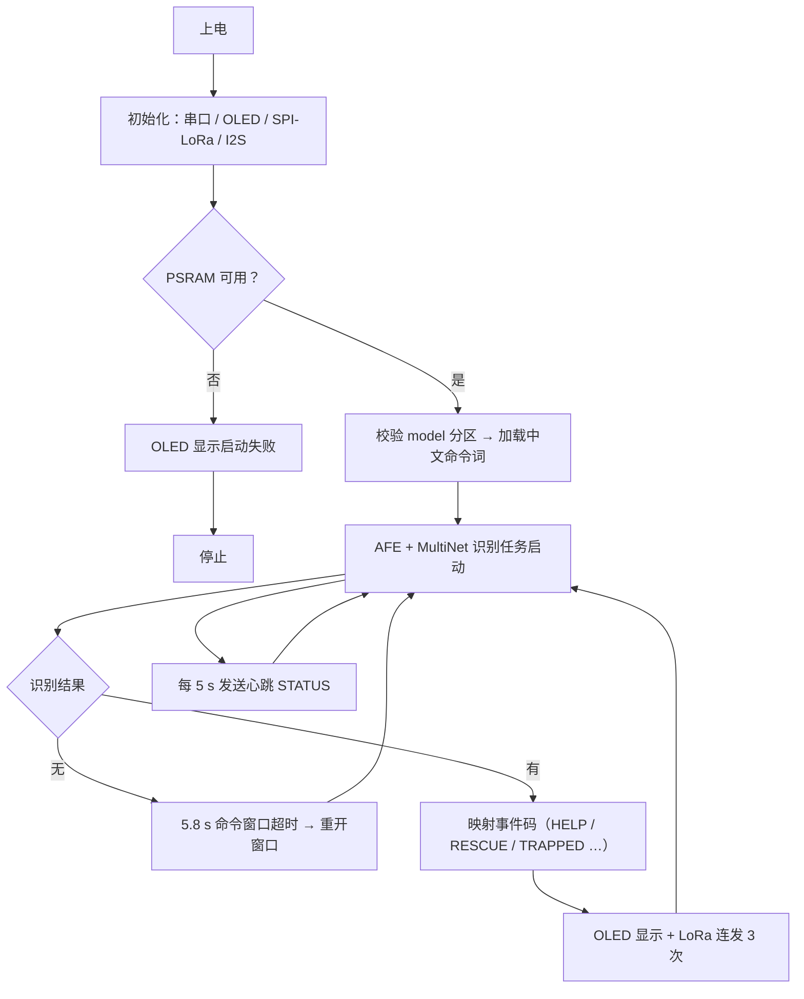

### 3.2 节点2：树莓派 5 离线转写节点

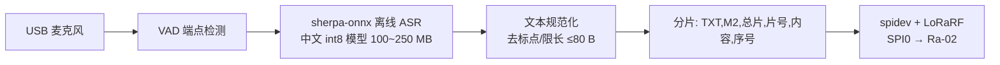

**设计要点**

- 系统：Debian/Ubuntu（Lite，无桌面）以降低功耗与温度；
- 推理：仅使用部分核心（`taskset`），int8 量化模型，控制温升；
- 可靠性：工业级存储（eMMC），掉电保护；断网/断电重启后自动恢复服务；
- 分片：单包内容 ≤ 80 字节（约 25 汉字），总片数 ≤ 9，含序号便于丢包定位。

**软件流程（节点2）**

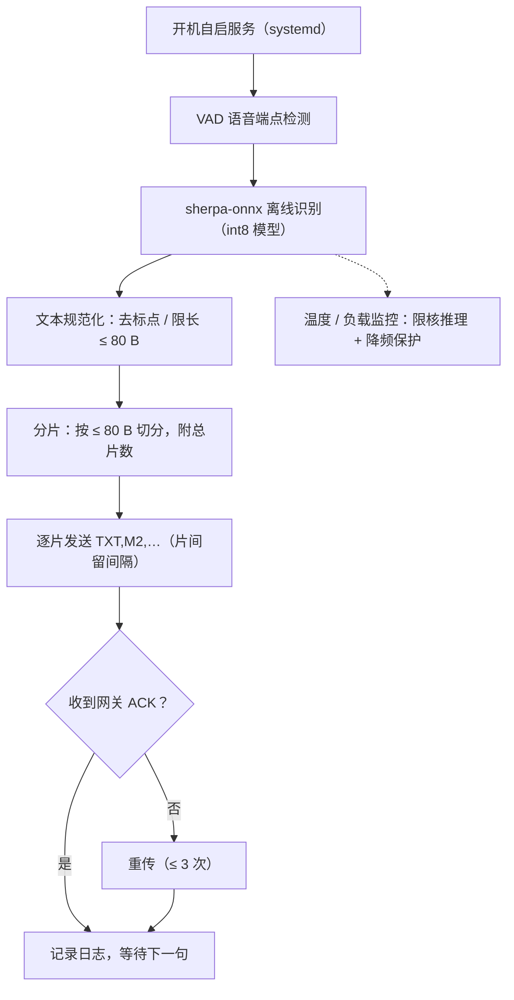

### 3.3 地面网关

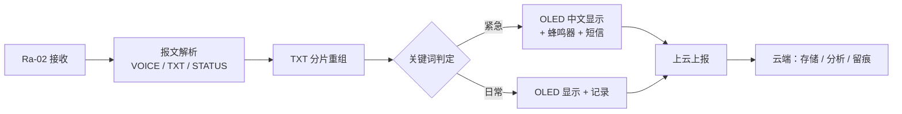

**设计要点**

- **报警不依赖 Linux**：MCU 上电 1.5 s 内即可报警；
- 修复了原实现中**未配置 Wi-Fi 时阻塞 20 s 导致 LoRa 丢包**的缺陷；
- 中文显示：OLED 采用 12 px 中文字库（U8g2 `u8g2_font_wqy12_t_gb2312`），自动折行。

**报文处理流程（含分片重组与分级报警）**

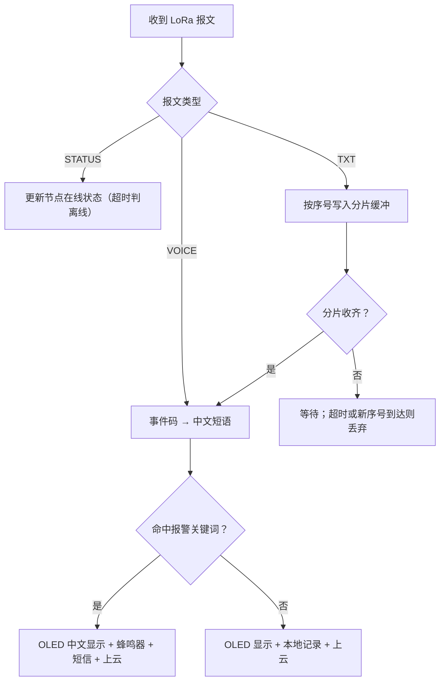

---

## 四、通信协议设计

### 4.1 射频参数（三端必须一致）

| 参数 | 取值 |
|---|---|
| 频段 | 433 MHz |
| 同步字 | 0xA3 |
| 扩频因子 / 带宽 / 编码率 | SF7 / 125 kHz / 4-5 |
| CRC / 前导码 | 开 / 8 |
| 功率 | 模块默认约 17 dBm（**注：中国 433 MHz 频段限值 10 dBm，正式部署须按法规调整**） |

### 4.2 应用层报文

| 报文 | 格式 | 用途 |
|---|---|---|
| 应急事件 | `VOICE,<节点>,<事件码>,<序号>` | 例 `VOICE,M1,HELP,12` |
| 心跳 | `STATUS,<节点>,<状态>,<序号>` | 例 `STATUS,M1,KWS_READY,37` |
| 日常文本 | `TXT,<节点>,<总片数>,<片号>,<内容>,<序号>` | 例 `TXT,M2,2,1,三号巷道风机有异响,8` |
| 回执（可选） | `ACK,<节点>,<序号>` | 送达确认 |

事件码约定：`HELP` 紧急救命、`RESCUE` 请求救援、`TRAPPED` 有人被困、`EVACUATE` 撤离、`GAS` 瓦斯、`WATER` 透水、`NORMAL` 一切正常。

### 4.3 链路时序（应急通道）

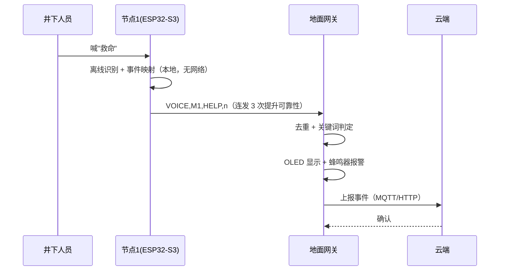

### 4.4 链路时序（日常转写通道）

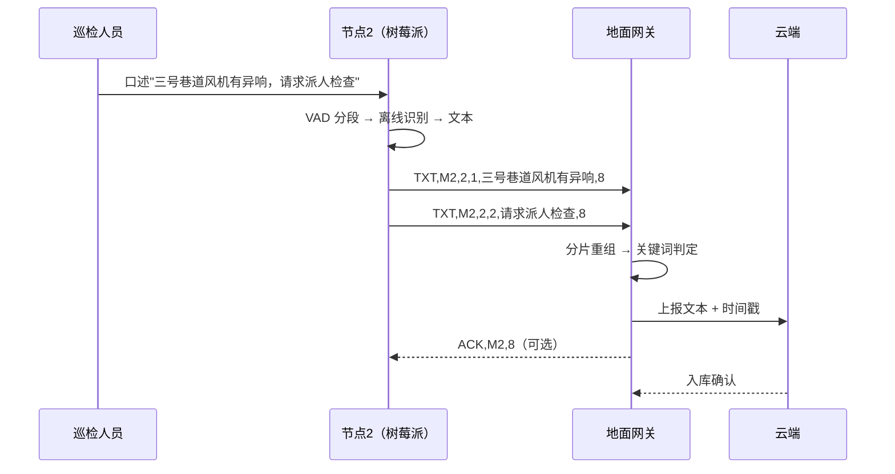

### 4.5 分片与重传时序（含丢包处理）

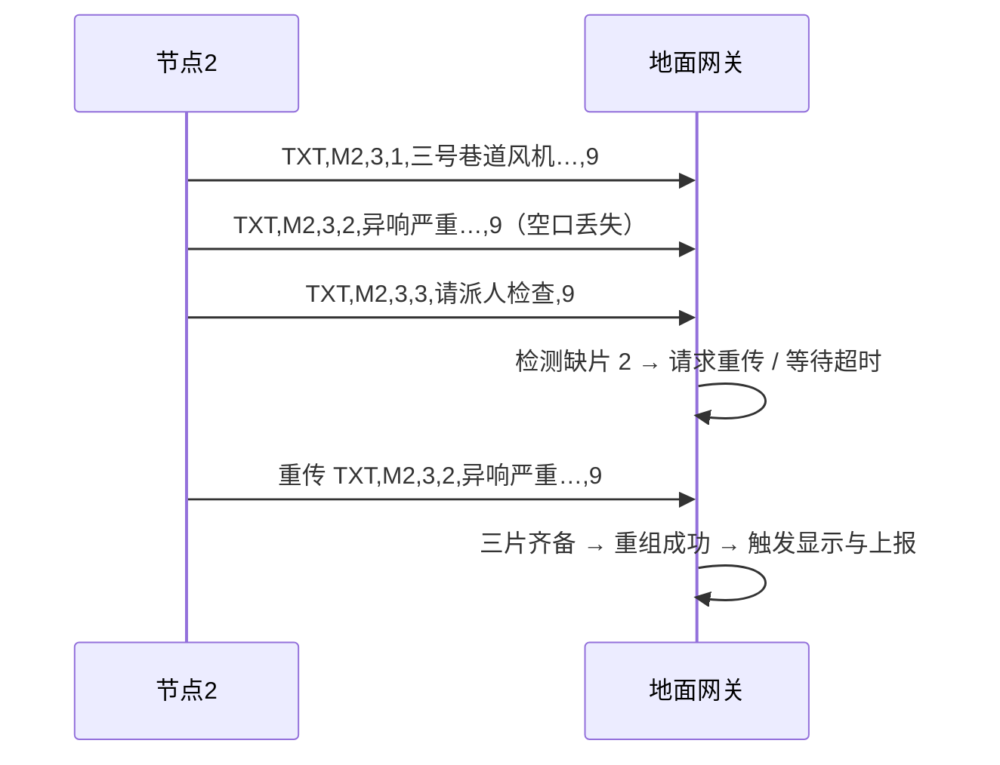

---

## 五、实验方案

### 5.1 实验目标

验证"井下离线语音采集 → LoRa 传输 → 地面报警与上云"全链路的**可用性、可靠性与时延**，并给出量化指标。

### 5.2 实验环境

| 类别 | 配置 |
|---|---|
| 节点1 | ESP32-S3 N16R8 + INMP441 + Ra-02（433 MHz 天线） |
| 节点2 | 树莓派 5（8 GB，eMMC）+ USB 麦克风 + Ra-02 |
| 网关 | ESP32-S3 N16R8 + Ra-02 + SH1106 OLED + 蜂鸣器 + SIM800L |
| 测试场地 | 校内实验楼／走廊（模拟巷道）；有条件的可申请**矿井/隧道现场**测试 |
| 噪声源 | 播放巷道噪声录音（约 70~85 dB） |
| 仪器 | 卷尺／激光测距仪、声级计、万用表、电流表（功耗） |

### 5.3 测试项、方法与指标

| 编号 | 测试项 | 方法 | 目标值 |
|---|---|---|---|
| T1 | 命令触发成功率 | 安静 / 70 dB / 85 dB 三档，0.5/1/2 m，各 50 次 | ≥ 95% |
| T2 | 误触发率 | 连续播放环境噪声 4 h | ≤ 1 次 / 4 h |
| T3 | 命令词识别率 | 3 条命令 × 20 次 × 3 噪声档 | ≥ 90% |
| T4 | 应急端到端时延 | 说"救命"到网关报警 | ≤ 2 s |
| T5 | 日常端到端时延 | 说完一句到网关显示文本 | ≤ 5 s |
| T6 | ASR 字错率（CER） | 50 句测试语料（安静/噪声） | 安静 ≤ 15%，噪声 ≤ 30% |
| T7 | LoRa 丢包率 | 0/50/100/200/400 m，各 100 包 | ≤ 10%（≤100 m） |
| T8 | 分片重组成功率 | 3 分片长句 × 50 次 | ≥ 95% |
| T9 | 节点1 续航 | 平均电流 × 电池容量 | ≥ 8 h（待定电池容量） |
| T10 | 断电恢复 | 反复断电 20 次，记录恢复时间 | 全部 ≤ 5 s |
| T11 | 长时稳定性 | 连续运行 24 h | 无死机、无异常重启 |
| T12 | 上云完整性 | 网关上报 100 条事件，核对云端记录 | ≥ 99% |

> 说明：T7 的 400 m 参照《煤矿井下人员位置监测系统通用技术要求》（计划号 20251546-Q-627）中"无遮挡无线传输距离 ≥ 400 m"的同类要求设置。<sup>[5]</sup>

### 5.4 数据记录表（模板）

| 序号 | 测试项 | 条件 | 样本数 | 成功数 | 结果 | 备注 |
|---|---|---|---|---|---|---|
| 1 | T1 命令触发成功率 | 安静，1 m | 50 | | | |
| 2 | T1 命令触发成功率 | 70 dB，2 m | 50 | | | |
| 3 | T7 丢包率 | 100 m | 100 | | | |
| … | | | | | | |

### 5.5 对照与消融

1. **噪声消融**：同距离下安静 vs 70 dB vs 85 dB，观察识别率下降幅度；
2. **距离消融**：0~400 m 步进，绘制丢包率与 RSSI 曲线；
3. **分片策略对照**：整包发送 vs 分片 + 重传，对比成功率与时延；
4. **双通道对照**：仅应急通道（MCU）vs 双通道并行，验证应急通道不受日常大流量影响。

### 5.6 异常与安全

- 测试全程遵守实验室用电与设备安全规范；天线必须接好后再发射；
- 实地测试前须取得场地许可，佩戴个体防护；
- 通信功率按国家无线电管理规定设置，避免干扰合法业务。

---

## 六、创新点

1. **双通道分级语音通信架构**：应急通道（MCU + 离线命令词，秒级、断网可用）与日常通道（Linux + 离线转写）互补，解决"事故断电断网后信息发不出"的痛点。
2. **中文命令词离线注册方案**：绕过 Arduino-ESP32 内核英文音素路径，直接驱动中文 MultiNet 模型完成拼音命令注册（稳定性修复见 3.1 技术要点）。
3. **文本级 LoRa 适配**：不传音频、只传文本与事件码，在 ≈5.5 kbps 空口上实现"日常说话可读、应急事件秒达"。
4. **报警不依赖操作系统**：地面报警逻辑运行在 MCU，Linux 侧仅做增强（大屏/上云），提高可用性。

---

## 七、开源软件与许可声明（必须提前说明）

> 本方案构建于多个开源项目之上。以下清单用于满足开源许可的**署名与声明**义务，也便于比赛/商用前的合规审查。

| 组件 | 用途 | 许可证 | 注意事项 |
|---|---|---|---|
| ESP-IDF 组件（esp-sr 框架） | 离线语音前端与命令词识别（AFE、MultiNet） | esp-sr 仓库主体为 **Apache-2.0** | **随附模型（MultiNet6 中文等）另有模型使用条款**，商用前须以乐鑫官方说明为准 |
| MultiNet6 中文模型（mn6_cn） | 中文命令词识别 | 模型许可（非源码许可） | 需在文档与答辩中明示来源；如用于商用产品须确认授权范围 |
| Arduino-ESP32 内核（含 `esp32-hal-sr.c`） | 固件框架 | **LGPL-2.1** | 本项目**修改了该文件**（中文命令词注册与崩溃修复）；按 LGPL 要求，修改后的对应源码已在项目内保留并可获取 |
| arduino-LoRa（sandeepmistry） | LoRa 驱动 | **MIT** | 保留版权与许可声明 |
| U8g2 | OLED 图形库与中文字库 | **BSD-2-Clause** | 库为 BSD-2；**内置字体版权各异**（含文泉驿等第三方字体），需单独核对并在文档中声明 |
| ArduinoJson | JSON 序列化 | **MIT** | |
| PubSubClient | MQTT 上报（如采用） | **MIT** | |
| Firebase-ESP-Client / SIM800 相关库 | 上云与短信（如采用） | 以各自仓库 LICENSE 为准 | 采用前须逐一核对 |
| sherpa-onnx（树莓派侧） | 离线中文语音识别 | **Apache-2.0** | |
| 中文 ASR 模型（paraformer / zipformer / SenseVoice 等） | 转写模型权重 | **以模型发布页许可为准** | 部分模型含商用限制，须**提前核对**；文档中需标明模型名称与来源 |
| Raspberry Pi OS / Debian | 节点操作系统 | 多许可（GPL 等） | 分发镜像时须保留许可证文件 |

**合规承诺**：本方案不使用任何未获授权的模型与数据；所有第三方组件的名称、版本、来源与许可均在文档、代码注释与答辩材料中明示。

---

## 八、风险与应对

| 风险 | 影响 | 应对 |
|---|---|---|
| LoRa 撞包（两节点共用 433 MHz） | 丢包、时延增大 | 应急包连发 3 次 + 网关去重；日常分片间隔发送；紧急事件优先 |
| 井下噪声导致识别率下降 | 命令漏识别 | 提高阈值/加长命令词、增加麦克风指向性与防风罩；必要时增加按钮触发兜底 |
| 树莓派功耗与散热 | 井下供电困难、降频 | Lite 系统 + 限核推理 + 被动散热（金属壳）；峰值按 5V/4A 设计电源 |
| 断电导致文件系统损坏 | 节点离线 | eMMC + 只读根分区 + 掉电保护 |
| 语音转写精度不足 | 日常通道可用性下降 | 限定场景词组、加纠错词表；必要时云端二次纠错（有网时） |
| 无线电合规 | 无法通过验收 | 按 433 MHz 限值调整发射功率，保留测试记录 |

---

## 九、进度安排（待填）

| 阶段 | 内容 | 时间 | 负责人 |
|---|---|---|---|
| 第一阶段 | 节点1 应急通道（已完成：命令词、LoRa、心跳） | | |
| 第二阶段 | 节点2 转写通道（树莓派 + ASR + 分片发送） | | |
| 第三阶段 | 网关解析/报警/上云 | | |
| 第四阶段 | 联调、实测与指标采集 | | |
| 第五阶段 | 文档与答辩材料 | | |

---

## 附录 A：总体方框图（纯文本版，便于直接粘入 Word）

```
┌──────────────── 井下 ────────────────┐
│ 节点1  ESP32-S3 N16R8（应急）          │
│   INMP441 ─► ESP-SR 离线命令词 ─┬─► OLED
│                                └─► Ra-02 ─┐
│ 节点2  树莓派5 8G（日常）                │
│   USB麦 ─► sherpa-onnx ASR ─► 分片 ─► Ra-02 ─┤
└──────────────────────────────────────────┘  │ 433 MHz / sync 0xA3
                                              ▼
┌──────────────── 井上 ────────────────┐
│ 地面网关  ESP32-S3 N16R8 + Ra-02      │
│   收包 ─► 解析(VOICE/TXT/STATUS) ─► 分片重组
│        ├─► OLED 中文显示               │
│        ├─► 蜂鸣器报警                  │
│        ├─► SIM800L 短信                │
│        └─► 云端平台（MQTT/HTTP）─► 数据分析与留痕
└──────────────────────────────────────┘
```

## 附录 B：参考来源

1. 张立亚．《智能矿山安全保障与融合通信技术》，煤炭科学技术研究院有限公司，2024-08（含国家首批智能化示范煤矿验收数据、智能化工作面数量、投资规模与政策文件清单）．https://www.chinamine-safety.gov.cn/fw/ksaqkj/zjjz/202408/W020240828579765739005.pdf
2. 国家矿山安全监察局等七部门．《关于深入推进矿山智能化建设促进矿山安全发展的指导意见》，2024-04-24．https://www.chinamine-safety.gov.cn/zfxxgk/fdzdgknr/tzgg/202404/t20240428_486312.shtml
3. 应急管理部．《煤矿安全规程》（应急管理部令第 17 号），2025-07-24 公布，2026-02-01 施行（第 543–545 条：人员位置监测系统要求）．https://www.gov.cn/gongbao/2025/issue_12326/202510/content_7043684.html
4. 国家矿山安全监察局．新版《煤矿安全规程》专题新闻发布会实录，2025-08-13．https://www.chinamine-safety.gov.cn/xw/xwfbh/ksjdyjdfbh2025_0813/wzsl/202508/t20250813_554416.shtml
5. 国家标准化管理委员会．国家标准计划《煤矿井下人员位置监测系统通用技术要求》（计划号 20251546-Q-627）．https://std.samr.gov.cn/gb/search/gbDetailedCNF?id=2E5255D178B08DE8E06397BE0A0AC3E5
6. 国务院．《煤矿安全生产条例》（国务院令第 774 号，2024-01-24 公布，2024-05-01 施行）．https://www.gov.cn/gongbao/2024/issue_11186/202402/content_6934550.html
7. 国家安全监管总局、国家煤矿安监局．《煤矿井下安全避险"六大系统"建设完善基本规范（试行）》（安监总煤装〔2011〕33 号，全文见中国网络电视台转载）．http://news.cntv.cn/china/20110324/107896.shtml
8. 国家安全监管总局、国家煤矿安监局．《关于建设完善煤矿井下安全避险"六大系统"的通知》（安监总煤装〔2010〕146 号）．注：该文在应急管理部网站标注为"已失效"，此处用于说明政策沿革。https://www.mem.gov.cn/gk/gwgg/agwzlfl/gfxwj/2010/201008/t20100826_243079.shtml
9. 国家矿山安全监察局贵州局、贵州省能源局．《关于进一步加强煤矿"三大系统"安全管理的通知》，2026-08-04．https://gz.chinamine-safety.gov.cn/detail.html?id=2084562293034799107

> 引用说明：来源 [7][8] 为"六大系统"政策的源头性文件，部分内容已被后续法规与标准更新；文中引用其表述仅用于说明"灾变期间通信联络必须可用"这一**政策延续要求**，现行有效依据以 [3][6][9] 为准。

> 提醒：文中标注【待实测】【待填】处需在完成实验后补齐真实数据；引用政策与标准时请以官方发布版本为准。
